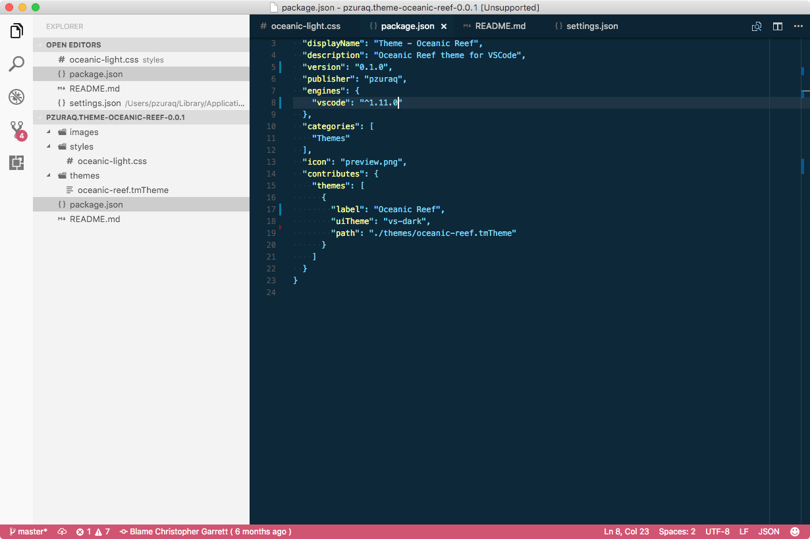
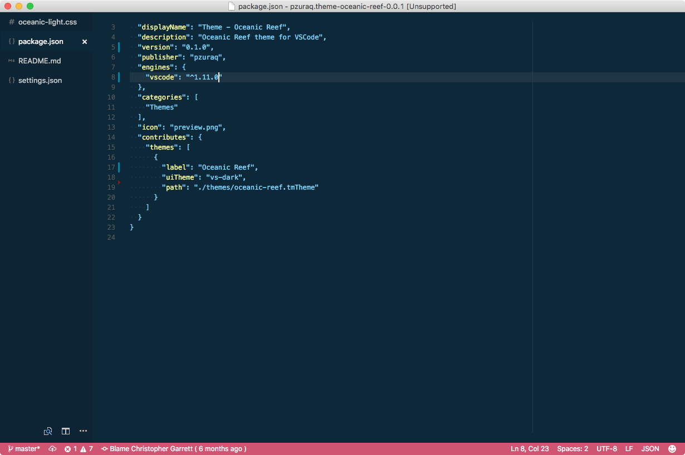

# Oceanic Reef Color Scheme and UI

Oceanic Reef color theme, based on the original [jeffschuil/oceanic-next-color-scheme] (https://github.com/jeffschuil/oceanic-reef-syntax). UI Theme included, with vertical tab bar focus mode (when sidebar is hidden)




## Install

In VSC press Ctrl+Shift+P (Cmd+Shift+P on Mac) then type ">ext install", hit enter, search "Theme - Oceanic Reef".


## UI Theme

`WARNING: USE AT YOUR OWN RISK - The API for UI customization is not stable yet, so this could break and make things look UGLY (Oh noes! :worried:)`

You will need:

* [VS Code Custom CSS Plugin](https://github.com/be5invis/vscode-custom-css)
* [Seti UI Icons](https://github.com/hellopao/vscode-seti-icons)

Add the following to your user settings. Make sure you substitute your home folder for the custom CSS path below.

```
{
    "vscode_custom_css.imports": [
        "file:///Users/PATH_TO_YOUR_HOME_FOLDER/.vscode/extensions/pzuraq.theme-oceanic-reef-0.1.0/styles/oceanic-light.css"
    ],
    "workbench.experimental.colorCustomizations": {
        "tabsContainerBackground": "#0C2433",
        "inactiveTabBackground": "#0C2433",
        "activeTabActiveGroupForeground": "#ffffff",
        "activeTabInactiveGroupForeground": "#cfcfcf",
        "inactiveTabActiveGroupForeground": "#cfcfcf",
        "inactiveTabInactiveGroupForeground": "#cfcfcf",
        "tabBorder": "#0C2433",

        "editorHeaderBackground": "#0C2433",
        "editorGroupBorder": "#0C2433",
        "editorGroupBackground": "#0C2433",
        "editorDragAndDropBackground": "#0C2433",
        "editorSideBySideBorder": "#0C2433",

        "statusBarBackground": "#D05572",

        "activityBarBackground": "#f9f9f9",
        "activityBarDragAndDropBackground": "#f9f9f9",
        "activityBadgeBackground": "#D05572",

        "sideBarBackground": "#f3f3f3",

        "inputBoxBackground": "#203f54",
    },
    "workbench.iconTheme": "seti",
    "window.titleBarStyle": "native"
}
```
