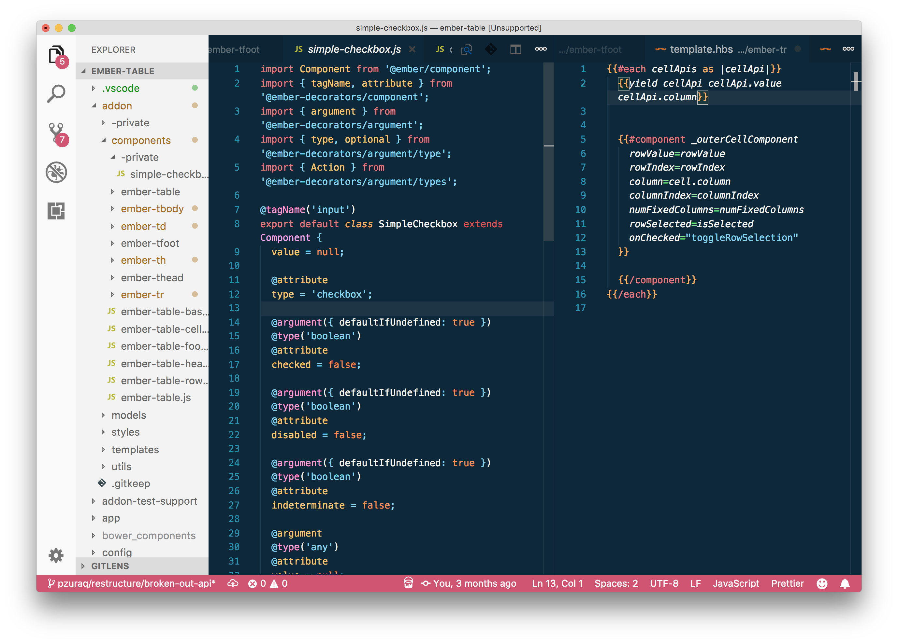
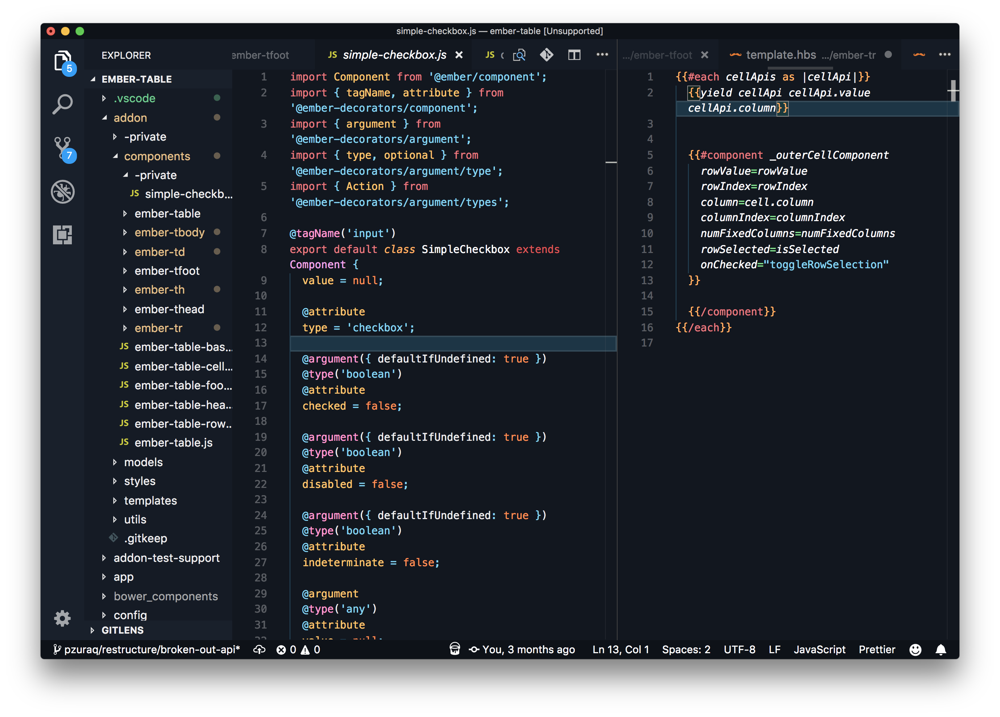

# Oceanic Reef

Oceanic Reef color theme, based on the original
[jeffschuil/oceanic-next-color-scheme](https://github.com/jeffschuil/oceanic-reef-syntax).

### Light Theme

### Dark Theme

## Install

In VSC press Ctrl+Shift+P (Cmd+Shift+P on Mac) then type ">ext install", hit enter, search "Theme - Oceanic Reef".

